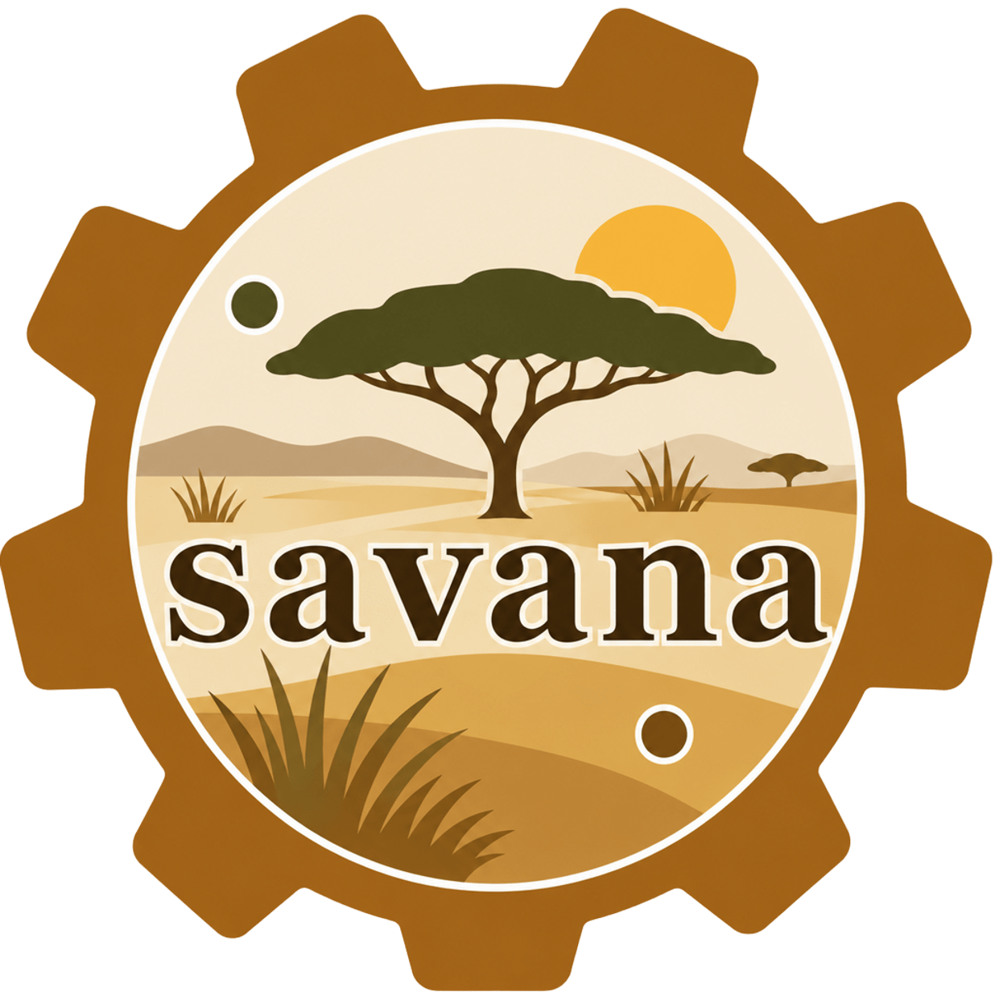

# Savana: A Geosptaial Intelligence for Savannah Landscapes

<p align="center">
  
</p>

<p align="center">
  <a href="https://pypi.org/project/savana/" target="_blank" rel="noopener noreferrer"></a>
  <a href="https://pypistats.org/packages/savana" target="_blank" rel="noopener noreferrer"></a>
  <a href="https://github.com/desmond-lartey/savana/blob/Fires/LICENSE" target="_blank" rel="noopener noreferrer"></a>
  <a href="https://github.com/desmond-lartey/savana/stargazers" target="_blank" rel="noopener noreferrer"></a>
  <a href="https://github.com/desmond-lartey/savana/network/members" target="_blank" rel="noopener noreferrer"></a>
  <a href="https://www.youtube.com/@desmondlartey31" target="_blank" rel="noopener noreferrer"></a>
</p>


**Adaptive classification of complex savanna landscapes into management-relevant land-system classes.**

Conventional LULC (land use / land cover) products typically collapse the internal
structure of savanna landscapes into one or two undifferentiated "grass/shrub" classes —
too coarse to be useful for protected-area management, grazing planning, or fire regime
analysis. `savana` implements a validated, fully adaptive classification method
(Sentinel-2 + Google AlphaEarth satellite embeddings + rainfall-normalised phenology)
that resolves savanna landscapes into ecologically meaningful classes such as Core
Woodland, Open Woodland, Shrub-Transition Savanna, Grassland, Riparian/Wetland
Vegetation, and Anthropogenic Disturbance — for *any* AOI, with **no hardcoded
thresholds**: every cutoff is derived from that landscape's own index percentiles.

This package started as the Google Earth Engine implementation behind a land-system
classification study of West African protected areas. It's designed as a foundation —
the four-model ablation, the RUE-validated conservative change detection, and the
adaptive thresholding are all built as independent, composable modules so new sensors,
feature stacks, and classification schemes can be added without breaking the existing API.

## Quick example

```python
import savana

clf = savana.classify_landscape(
    aoi="path/to/my_area.geojson",
    epochs=[2019, 2021, 2024],
    park_name="My Study Area",
)

clf.show()                  # interactive map in Jupyter
clf.accuracy_summary()      # pandas.DataFrame — one row per model
```

See **Installation** and **Quick Start** in the sidebar to get going, or **Method
Overview** for the science behind it.

## Citation

If you use this package in your research, please cite the associated manuscript
(citation to be added on publication).

## 📄 License

Savana is free and open source software, licensed under the MIT License.

## Acknowledgments

We gratefully acknowledge the support of the following organizations:

-   [Irish Research Council](https://research.ie/funding/goipg/): This research is supported by the Government of Ireland Postgraduate Scholarship through Grant No. GOIPG/2025/8306, awarded under the [Reseearch Ireland Program](https://www.researchireland.ie/funding/government-ireland-postgraduate/).
-   [Department of Geography](https://www.mic.ul.ie/faculty-of-arts/department/geography?index=0): This work is also partially supported by the department of Geography, Mary Immaculate College.
